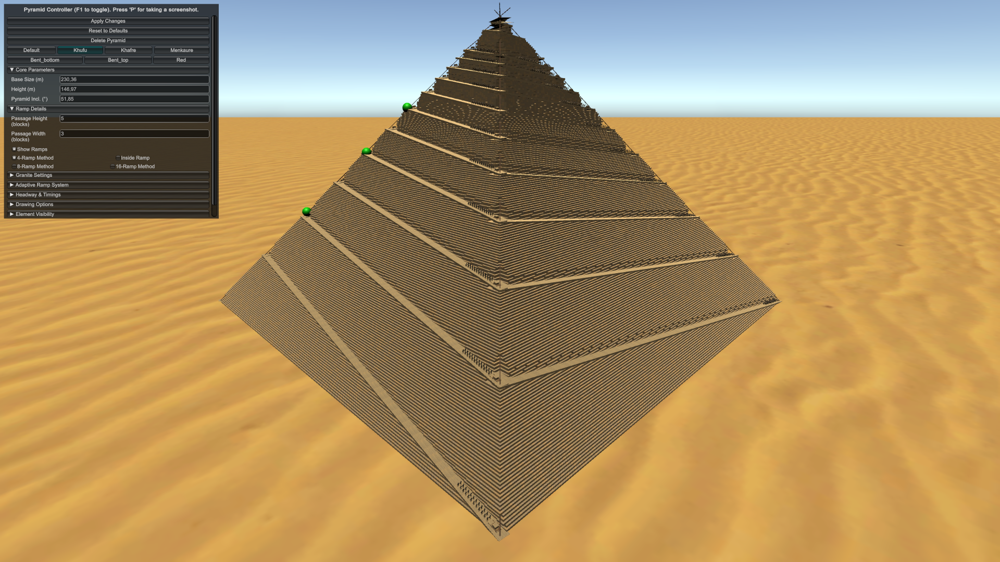

# Khufu Pyramid – Unity Simulation (Integrated Edge-Ramp)



---

## 📊 Metadata & Citation

**Version:** v1.0.11 (final submission package for npj Heritage Science)  
**DOI:** [https://doi.org/10.5281/zenodo.16732345](https://doi.org/10.5281/zenodo.16732345)  
**Author:** Vicente Luis Rosell Roig (ORCID: 0009-0003-8857-9706)  
**Affiliation:** Independent Researcher; PhD in Pattern Recognition, Artificial Intelligence and Computer Graphics, Universitat Politècnica de València (UPV), Spain.  

If you use this dataset or code, please cite:  

> Rosell Roig, V.L. (2025). *A computational framework for evaluating an edge-integrated, multi-ramp construction model of the Great Pyramid of Giza* [Data set]. Zenodo. https://doi.org/10.5281/zenodo.16732345

---

## 🔍 Software dependencies

* **Unity 6000** or newer (tested with Unity 6000.2).  
* **C# 9.0** (scripts in `Assets/Scripts`).  
* **Python 3.11** with `numpy`, `pandas`, `matplotlib` (for additional analysis).  
* **SimScale / Code_Aster v15.6.10/MUMPS v5.2.1** (for FEA runs; models exported under `AdditionalData/SimScale/`).  
* **Blender 4.4** (for optional 3D visualization of OBJ exports).  

---

## 🏗️ Available Ramp Construction Methods

**Straight** - Straight external ramp approaching one face (Arnold 1991, Lehner 1997)

**Spiral** - External spiral ramp wrapping around pyramid perimeter (Arnold 1991, Lehner 1997)

**Internal** - Internal spiral ramp within pyramid core (Houdin 2006)

**Integrated** - Edge-integrated ramp using temporarily omitted perimeter courses
- Single helical ramp (baseline)
- 4-ramp parallel configuration
- Adaptive sequence (16→8→4→2→1 ramps)
- Parapet-enhanced safety variant
- Macro-terrace compatible version

All methods implement identical physical parameters for direct comparative analysis.

---

## 📂 File formats

* `.csv` – block-by-row data, headway summaries, Monte Carlo outputs.  
* `.xlsx` – consolidated tables for manuscript figures.  
* `.stl`, `.obj` – 3D meshes of pyramid and ramp geometry.  
* `.mp4` – supplementary videos (course-by-course and ramp sequences).  
* `.zip` – bundled project exports from SimScale.  
* `.cs`  – C# scripts.  
* `.py` – Phyton.  
* `.ipynb` – Python Notebook.  

---

## 📑 Changelog

* **v1.0.11** – Added code updates.
* **v1.0.10** – Added code updates.
* **v1.0.4** – Added code updates.  
* **v1.0.3** – Added refined Monte Carlo tables; Code updates for UI; Images.  
* **v1.0.2** – Added fine mesh FEA run; refined Monte Carlo tables; updated README with workflow diagram.  
* **v1.0.1** – Initial Zenodo deposit, included Unity scenes and CSV tables.  
* **v1.0.0** – Prototype release (internal use only).  

All results in the npj Heritage Science submission can be reproduced exactly using the archived Unity project, CSV/Excel tables, and SimScale exports. Earlier versions remain available in the Zenodo record history for transparency

---

## 📜 License

* **Code:** MIT License  
* **Data, figures, and documentation:** CC-BY 4.0 

---

**Data & Code availability**
All simulation scripts, block‑by‑row tables and the Unity scene are archived on Zenodo: [https://doi.org/10.5281/zenodo.16732345](https://doi.org/10.5281/zenodo.16732345)

---

## 📂 Project structure

| Path                                  | Description                                                                                                                               |
| ------------------------------------- | ----------------------------------------------------------------------------------------------------------------------------------------- |
| **Assets/Scenes/SampleScene**         | Main demo scene. Add an empty **GameObject** and attach **GeneratePyramid** (and optional **PyramidSequence**).                           |
| **Assets/Scenes/MultiplePyramides**   | Showcase scene with several pyramids for side‑by‑side comparison/screenshots; each pyramid has its own **GeneratePyramid** configuration. |
| **Assets/Scenes/TerracePyramid**      | Showcase scene with a terrace pyramid for study Müller-Römer F. theory; each terrace has its own **GeneratePyramid** configuration.       |
| **Assets/Scripts/GeneratePyramid.cs** | Core generator: parameters in the Inspector; builds blocks/ramps; CSV logs; OBJ export.                                                   |
| **Assets/Scripts/PyramidSequence.cs** | Step‑by‑step builder/recorder that advances course‑by‑course and optionally saves PNG frames.                                              |
| **Assets/Scripts/PyramidGUIController.cs** | Interactive runtime GUI to control GeneratePyramid during Play Mode.                                                                 |
| **Assets/Prefabs/**                   | Stones, wooden sled, Egyptians, vegetation…                                                                                               |
| **Assets/Materials/**                 | Sandstone, wood, floor, corner, etc.                                                                                                      |
| **AdditionalData/**                   | Companion dataset folder with the files used in the manuscript. Subfolders:`Montecarlo_ramp/`,`SimScale/`,`Tables/`.,`Images/`.,`Videos/`.|

---

## 🚀 Quick start

1. **Open** the project in **Unity 6000 or newer** and load *SampleScene* **or** *MultiplePyramides*.
2. Add an empty object (e.g., **Pyramid**) and **Add Component → GeneratePyramid**. Press **Play** to build the full model.
3. *(Optional)* For a **course‑by‑course animation**, also add **PyramidSequence** and press **Play**. It will increment rows, clean previous geometry and (if enabled) capture PNGs.

> Tip: Generation happens in **Edit/Play** depending on the toggles; physics updates and screenshots require **Play Mode**.

### About *MultiplePyramides* scene

* Preconfigured with **several pyramids** laid out in the desert for side‑by‑side comparisons (angles, ramp modes, materials).
* Each pyramid is an independent **GeneratePyramid** instance; tweak them separately in the Inspector.
* Ideal for **screenshots**, **performance checks** and **method comparisons**.

---

## 🔧 Key parameters (GeneratePyramid)

| Category              | Variable                                                                                                                                  | Meaning                                                                    |
| --------------------- | ----------------------------------------------------------------------------------------------------------------------------------------- | -------------------------------------------------------------------------- |
| **Geometry**          | `BaseSize`, `Height`, `PyramidInclination`, `RampInclination`                                                                             | Global pyramid and ramp angles/sizes.                                      |
|                       | `DrawUntilRow`, `DrawOnlyRow`, `DrawRow`, `DrawBlocks`                                                                                    | Build up to a course, only a course, or a fixed number of outer layers.    |
| **Ramp modes**        | `Method16Ramp`, `Method8Ramp`, `Method4Ramp`, `Method2Ramp`, `MethodInsideRamp`                                                           | Select 16/8/4/2 edge-ramps and inside/edge variant.                        |
| **Visuals**           | `DrawWall`, `DrawFloor`, `DrawWoodenCyl`, `DrawEgyptians`, `DrawGranite`, `DrawCover`, `showRamps`, `halfPyramid`                         | Rendering toggles for inspection.                                          |
| **Logging (CSV/TXT)** | `showInfoLevel`, `showInfoLevelTotal`, `showInfoLevelDec`, `showInfoRow`, `showInfoGranite`;                                              |                                                                            |
|                       |  filenames: `csvitername`, `csvrowname`, `csvheadway`, `txtname`, `pyramid_granite`                                                       | Write iteration, per-row and headway summaries to `/persistentDataPath/…`  |
| **Headway model**     | `AverageHeadway`, `MinHeadway`, `MaxHeadway`, `WorkingYearMinutes`, `PyramidHeadwayType`                                                  | Throughput assumptions used in time estimates.                             |
| **Export**            | `exportPyramidObj`, `exportCombineMeshes`, `exportSubFolder`, `outputFileName`                                                            | OBJ export of the generated meshes (pyramid, ramp).                        |

---

## 🎞️ Step‑by‑step building & screenshots (PyramidSequence)

Attach **PyramidSequence** to the same GameObject as **GeneratePyramid** to:

* **Advance automatically** one course at a time (`DrawUntilRow`/`DrawRow` are driven for you).
* **Clean & rebuild** between steps so the scene only contains the current state.
* **Capture PNG frames** each step when *Capture* is enabled; set *LapseSeconds* for the delay between captures.
* Optionally point to a specific **Camera**; if empty, it will find the main camera.

This is ideal to render time‑lapses or to verify per‑course geometry and headway CSV outputs match the visual model.

---

## 🏃‍♀️ Recipes

### Adaptive ramp schedule (16 → 8 → 4)

```csharp
var gp = GetComponent<GeneratePyramid>();
gp.Method16Ramp = true;   // early courses
gp.Method8Ramp  = true;    // mid courses
gp.Method4Ramp  = true;    // upper courses
```

### Course‑by‑course capture

```csharp
var ps = GetComponent<PyramidSequence>();
ps.Capture = true;      // save PNG per course
ps.LapseSeconds = 0.5f; // wait between steps
```

---
## 📤 Log export

```csharp
ps.showInfoLevel = true;
ps.showInfoLevelTotal = true;
ps.showInfoLevelDec = true;
ps.showInfoRow = true;
ps.showInfoGranite = true;
```

| File                         | Columns    
| ---------------------------- | ----------------------------------------------------------------------------------------------------------------------------------------- | 
| **pyramid_row.csv**          | Row;blocks;ramp inclination;Ramp length (m);Ramp length total (m);distance blocks (Km);distance blocks Ramp (Km);distance blocks Horiz (Km);Sum force blocks (MJ);Sum Vert. force blocks (MJ);Sum Horiz. force blocks (MJ);Vert. force blocks row (MJ);Horiz. force blocks row (MJ);Total force blocks row (MJ);% Decrement blocks;% increase Distance;% increase Force|
| **pyramid_iter.csv**         | Course;Height;blocks;Separation;New base size;Length;Ramp inclination;Start height;% total height;Ramp length (m)|
| **pyramid_headway.csv**      | Row;blocks;up ramps;blocks per ramp;fixed headway(min);adaptative headway(min);total time(min);adaptative total time(min);total time(working years);adaptativive total time(working years)|
| **pyramid_granite.csv**      | row;Percentage;Curse heigh(m);ramp slope(degrees);ramp distance(m);horiz distance(m);total blocks;total displacement time (h);setup time (h);total time (h);total (working years);pullers x blocks;total Work (MJ)|

---

## 📤 OBJ export

Enable `exportPyramidObj` and **Play**. The mesh (optionally combined) is written to:

```
%APPDATA%/…/<Project>/PyramidModels/<outputFileName>.obj
```

Change `exportSubFolder` and `outputFileName` to customise the path.

---

## 📑 Reproducibility

* CSV/TXT logs are created when the *showInfo…* flags are enabled (iteration, per‑row, headway).
* All CAD, meshes and run settings are mirrored on the Zenodo record above.

---

## 📦 Additional data (manuscript dataset)

The repository includes an **AdditionalData/** folder with the inputs/outputs used to build the figures and tables:

* **AdditionalData/Montecarlo/** — batches of parameter sweeps and simulation runs for ramp scenarios.
* **AdditionalData/SimScale/** — exported project files/reports from SimScale runs used for cross‑checks.
* **AdditionalData/Tables/** — CSV/Excel tables referenced in the manuscript (e.g., per‑row counts, headway summaries, Table 1–4 sources).
* **AdditionalData/Images/** — paper generated images.
* **AdditionalData/Videos/** — paper timelapse videos: 1-Ramp, 4-Ramp and Adaptative Ramp System.

These files mirror the archive on Zenodo so reviewers can reproduce every number in the paper.

### 🔗 Public SimScale projects

For transparency, the SimScale setup used for cross‑checks is shared publicly:

* **piramide\_keops\_4\_rampas** — [https://www.simscale.com/projects/alux/pyramid_keops_4_ramps/]

*(Exports of these projects are also mirrored under `AdditionalData/SimScale/`.)*
Note: project may require login (free).

---

## 📐 Geometric Registration & Error Budget

- **Source Data**: Canonical dimensions from Lehner (2008) with ±0.3m uncertainty
- **Control Points**: Base corners, apex position from literature
- **Propagated Errors**: ±1.2% in ramp lengths, ±0.8° in turn elevations
- **Validation**: Compared against McKenzie (2016) course height data (RMS: 0.42m)

---

## Dependencies
All Python dependencies are listed in the requirements.txt file. To create the necessary environment, navigate to the repository's root directory and run:

pip install -r requirements.txt

---

## 📝 License

MIT License. If you use this code in academic work, please cite the paper *“A computational framework for evaluating an edge-integrated, multi-ramp construction model of the Great Pyramid of Giza.”*
